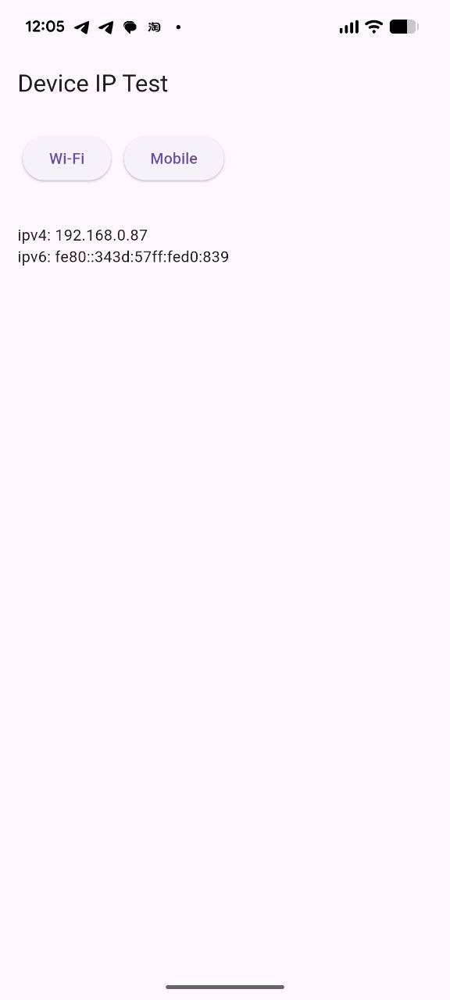
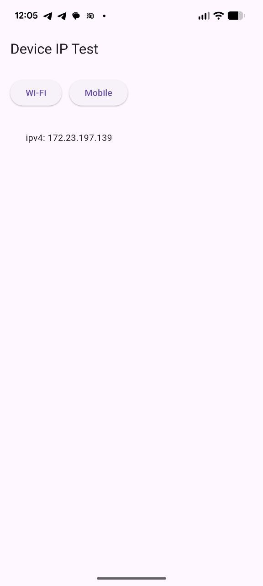
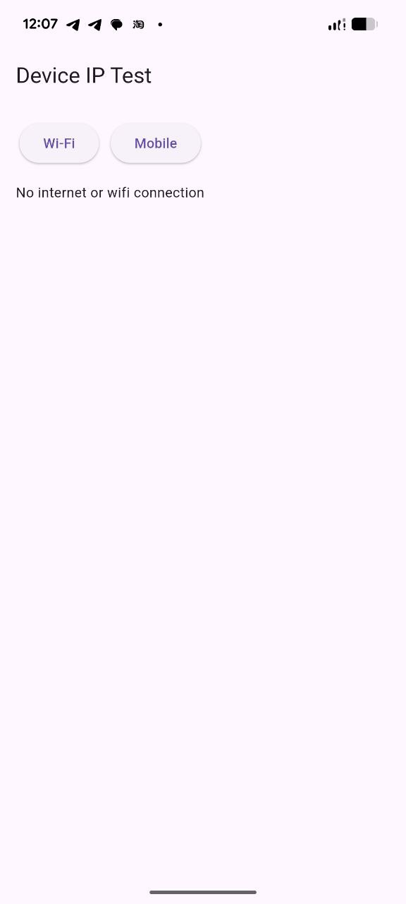

## Screenshots

Wi-Fi output:



Connected state:



No internet state:



# device_ip

Flutter plugin to get local device IP addresses (IPv4/IPv6) from Wi-Fi or mobile network.

> Notice: This plugin currently works on Android.

## What It Returns

`DeviceIp.getIp(...)` returns an `IpResult` with:

- `ok`: `true` when an address is found
- `message`: `"OK"` or `"No internet connection"`
- `connection`: `wifi`, `mobile`, or `none`
- `ipv4`: IPv4 address (if available)
- `ipv6`: IPv6 address (if available)

## Run The Example (From The Outer Project Folder)

From the root of this plugin repository (the outside folder), run:

```bash
cd example
flutter pub get
flutter run
```

## Expected Output In The Example App

When the app opens:

- You will see the text: `Press a button`
- Tap `Wi-Fi` to fetch Wi-Fi IP
- Tap `Mobile` to fetch mobile IP

Typical successful output on screen:

```text
OK
ipv4: 192.168.x.x
ipv6: fe80::xxxx:xxxx:xxxx:xxxx
```

When the selected network is unavailable, you will see:

```text
No internet connection
```
